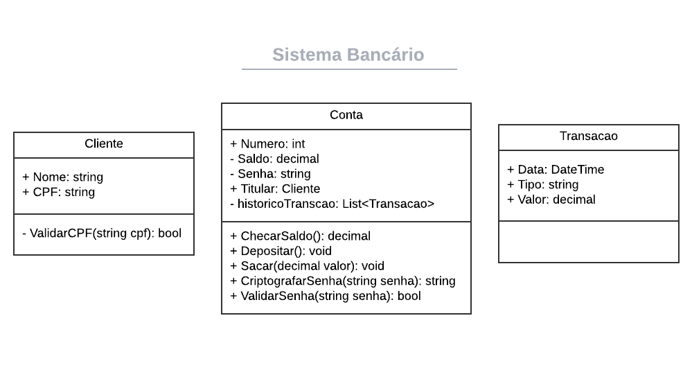

Sistema Bancário
================

Este é um projeto de um sistema bancário simples, desenvolvido em C# com o objetivo de práticar conceitos de programação orientada a objetos. O sistema permite a criação de clientes e contas bancárias, além de funcionalidades como depósitos, saques e consulta ao histórico de transações.

Funcionalidades
---------------

1.  **Criação de Clientes**:
    
    *   Nome e CPF são validados no momento da criação.
        
2.  **Criação de Contas**:
    
    *   Permite criar uma conta associada a um cliente, com opção de depósito inicial.
        
    *   Senha da conta é criptografada utilizando algoritmos simples implementados no código.
        
3.  **Operações Bancárias**:
    
    *   Consulta de saldo.
        
    *   Realização de depósitos e saques com validação.
        
    *   Exibição de histórico de transações.
        
4.  **Segurança**:
    
    *   A senha da conta é armazenada de forma criptografada.
        

Estrutura do Projeto
--------------------

O projeto é composto pelos seguintes arquivos e classes:

### Arquivos

*   **Cliente.cs**
    
    *   Classe para representar o cliente do banco, contendo nome e CPF.
        
    *   Realiza validação do CPF baseado em regras padrão.
        
*   **Conta.cs**
    
    *   Classe para gerenciar contas bancárias.
        
    *   Contém métodos para depósitos, saques, consulta de saldo e histórico de transações.
        
    *   Implementa criptografia para as senhas.
        
*   **Transacao.cs**
    
    *   Classe que registra informações sobre transações, como tipo, valor e data.
        
*   **Program.cs**
    
    *   Arquivo principal que executa o sistema.
        
    *   Contém o menu para interação com o usuário e a implementação da lógica do programa.
        

### Diagrama:



Requisitos
----------

*   **Plataforma**: .NET 6 ou superior.
    
*   **Linguagem**: C#.
    

Executando o Projeto
--------------------

1.  Certifique-se de que o .NET SDK está instalado em seu ambiente.
    
2.  Navegue até o diretório do projeto no terminal.
    
3.  Compile e execute o programa com os seguintes comandos:
```
dotnet build
dotnet run
``` 

Licença
-------

Este projeto é licenciado sob a Licença MIT. Consulte o arquivo LICENSE para mais informações.